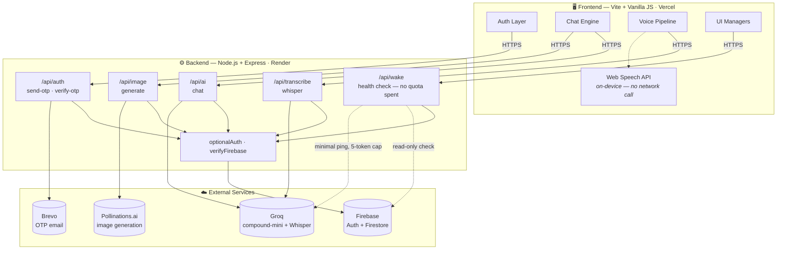

<div align="center">

# ⚡ Joule AI

**A cinematic, full-stack AI chat experience. Built from scratch. Alone.**

<br/>

> *"Not a wrapper. Not a template. Every pixel, every function, every decision — made by one person."*

<br/>

[](https://joule-ai.vercel.app)
[](https://joule-ai-backend.onrender.com)
[](https://nodejs.org)
[](https://vitejs.dev)
[](https://groq.com)
[](https://firebase.google.com)


</div>

---

## 📖 Table of Contents

- [What is Joule AI?](#-what-is-joule-ai)
- [Screenshots](#-screenshots)
- [Feature Breakdown](#-feature-breakdown)
  - [Loading Screen](#-loading-screen--aurora-physics-animation)
  - [Dual Theme System](#-dual-theme-system)
  - [Shinigami Mode](#-shinigami-mode--secret-konami-code)
  - [AI Chat Engine](#-ai-chat-engine)
  - [Live Web Search](#-live-web-search--weather-scores--current-events)
  - [AI Image Generation](#-ai-image-generation)
  - [Private Chat Mode](#-private-chat-mode)
  - [Voice System](#-voice-system)
  - [Text-to-Speech](#-text-to-speech)
  - [Authentication](#-authentication)
  - [OTP Verification](#-otp-email-verification)
  - [Google Sign-In](#-google-sign-in)
  - [Chat History Sidebar](#-chat-history-sidebar)
  - [Profile Panel](#-profile-panel)
  - [Music Player](#-ambient-music-player)
  - [Legal Overlays](#-legal-overlay-system)
  - [Usage Limits](#-tiered-usage-limits)
  - [Markdown Rendering](#-markdown-rendering)
- [Architecture](#-architecture)
- [Tech Stack](#-tech-stack)
- [Security](#-security)
- [Environment Variables](#-environment-variables)
- [Local Development](#-local-development)
- [Deployment](#-deployment)
- [Project Structure](#-project-structure)
- [Known Limitations](#-known-limitations--honest-notes)
- [License](#-license)
- [Author](#-author)

---

## 🔥 What is Joule AI?

Joule AI is a **production-grade, full-stack AI chat application** built entirely by one developer. It's not a UI kit slapped on top of an API. It's a carefully architected system with:

- A **physics-based aurora canvas loading screen** that converges ribbons of light into the logo
- A **dual-personality theme system** — clean default and a horror-mode called *Shinigami*
- A **real-time streaming AI chat engine** powered by Groq, with **built-in live web search** for weather, sports scores, and current events — no separate API integration required
- **AI image generation** with one-click download
- A **private/incognito chat mode** — nothing saved, ever
- A **full voice pipeline**: microphone input → real-time transcription → silence detection → auto-send
- **Text-to-speech** with a distinct delivery per theme, entirely on-device
- A **chat history sidebar** with rename, delete, and session persistence
- **Firebase Auth + Brevo OTP email verification** + Google Sign-In
- **Tiered daily usage limits** with Firestore transactions — and automatic refunds when the AI fails to respond

Every feature was designed and coded by hand. Zero boilerplate. Zero AI-generated scaffolding.

---

## 📸 Screenshots

> Screenshots aren't embedded yet — add your own by dropping images into a `screenshots/` folder at the repo root and pointing the links below at them. Suggested shot list, in order:

| # | Shot | Suggested filename |
|---|------|---------------------|
| 1 | Default (light) theme, empty chat, loading screen mid-animation | `screenshots/loading-screen.png` |
| 2 | Default theme, an active conversation with a markdown-formatted reply | `screenshots/chat-light.png` |
| 3 | Dark theme, same conversation | `screenshots/chat-dark.png` |
| 4 | Shinigami mode — full red/black transformation | `screenshots/shinigami-mode.png` |
| 5 | An AI-generated image in the chat, with the download button visible | `screenshots/image-generation.png` |
| 6 | Chat history sidebar open, showing multiple saved sessions | `screenshots/sidebar.png` |
| 7 | Private/ghost chat mode active (ghost icon lit, violet tint visible) | `screenshots/private-mode.png` |
| 8 | Voice input mid-recording, transcript overlay visible | `screenshots/voice-input.png` |
| 9 | Profile panel open, avatar grid visible | `screenshots/profile-panel.png` |
| 10 | Mobile view — chat + collapsed controls | `screenshots/mobile.png` |

```md
<!-- Once captured, embed like this: -->


```

---

## 🎯 Feature Breakdown

### 🌊 Loading Screen — Aurora Physics Animation

The first thing you see is not a spinner. It's a **custom physics-based canvas animation** built from scratch using the Web Animations API and `requestAnimationFrame`.

**How it works:**
- 5 colored ribbon particles (cyan, indigo, violet, deep indigo) are initialized at golden-angle-distributed positions around the screen
- Each ribbon has layered sine-wave wobble — multiple frequencies so it undulates organically rather than as a single clean wave
- **Phase 1 (1.5s):** Ribbons drift freely with their own independent speed and amplitude
- **Phase 2 (1.45s):** Convergence — ribbons gradually interpolate toward the logo's center using `easeInOutCubic`
- **Phase 3 (0.35s):** Flash/condensation — a burst of 28 spark particles explodes from the landing point, with radial glow effects using `"lighter"` composite blending
- **Phase 4 (0.5s):** Dissolve — sparks fade, logo solidifies
- A **soft trailing fade** (`rgba(5,5,16,0.32)` fill each frame) creates light trails instead of hard clearing — the aurora "memory" effect
- Runs in parallel with a **smooth progress bar** using a custom `easeProgress` function that reaches 92% fast then slows to 100%
- DPI-aware (`devicePixelRatio` capped at 2) and **fully responsive** — recalculates landing point on resize

```
DRIFT → CONVERGE → FLASH ✦ → DISSOLVE → Logo reveal
1500ms   1450ms    350ms       500ms
```

---

### 🎨 Dual Theme System

Joule AI ships with two visual modes persisted across sessions in `localStorage`.

**Default (Light) Theme:**
- Aurora-inspired palette — soft blues, cloud textures, mountain backgrounds
- Frosted glass UI elements with `backdrop-filter: blur()`
- Subtle gradient borders, shadow depth layers
- Logo: custom bot avatar with blue glow

**Dark Theme:**
- Deep navy backgrounds
- Elevated contrast for readability
- Same component system, different palette
- Toggle button spins 360° on switch (CSS `spin` class, 500ms)

Theme state flows through a centralized state store → `themeManager.js` → `persistence.js` (saves to `localStorage`) → applied as `.dark` class on `<body>`.

---

### 💀 Shinigami Mode — Secret Konami Code

Shinigami Mode is the crown jewel of Joule AI. It's a **complete personality transformation** of the entire UI — triggered by a secret keyboard sequence.

**Activation:** Do the following in page:
```
    Click on the signature "Aayushmaan" 7 times rapidly...

```

**What changes:**

| Element | Normal | Shinigami |
|---------|--------|-----------|
| Background | Aurora/sky gradient | Deep black with blood-red fog |
| AI Avatar | Friendly bot | Shinigami death god image |
| Font color | Blues and grays | Red glows and dark reds |
| Modal overlays | Frosted glass, blue accent | Black glass, crimson border |
| Top accent lines | Blue → violet gradient | Blood red gradient |
| Scrollbars | Blue tinted | Red tinted |
| Footer links | Blue | Muted crimson |
| Legal modal | Blue headings | Red headings, dark body |
| **AI Voice** | Default pitch/rate | **Lower pitch, slightly slower** |
| Profile panel | Blue accents | Red accents |
| Sidebar | Standard | Red highlights, dark bg |

The mode toggle is handled entirely in `animationManager.js` — it listens to `keydown` globally, builds a rolling sequence buffer, compares against the target sequence with `.join(",")`, and fires `activateShinigamiProtocol()` / `disableShinigami()`.

Toggling again deactivates it. No page refresh. Instant full-UI transformation.

---

### 🤖 AI Chat Engine

The chat core is powered by **Groq** — ultra-fast LLM inference, currently running `groq/compound-mini`.

**Features:**
- **Real token-by-token streaming** — not a simulated typewriter. The backend streams Groq's actual response chunks over a chunked HTTP response (`res.write()` per token as it arrives); the frontend reads it via `response.body.getReader()` and appends each real chunk to the DOM as it's decoded. What you see arriving is what Groq is actually generating, in real time.
- **Markdown rendering** — full support for `**bold**`, `_italic_`, `` `code` ``, ` ```code blocks``` `, headers, and lists via a custom `renderMarkdown()` utility
- **Auto-scroll management** — smart scroll that follows new messages unless the user has scrolled up manually (`isUserScrollingUp` state flag)
- **Bot/user avatars** on every message — theme-aware (Shinigami swaps the bot avatar)
- **Clear chat** button with trash icon — wipes the current session
- **Conversation ID tracking** per session — each chat has a UUID
- **Refund-safe usage tracking** — if Groq fails to respond (rate limit, outage, anything), the message quota it consumed is automatically refunded rather than silently lost

The AI route on the backend (`Routes/ai.js`) applies the optional auth middleware, checks usage via Firestore transactions, and streams the Groq response back.

> **A note on the model:** Joule originally ran `llama-3.3-70b-versatile`. Groq deprecated that model in mid-2026 (shutdown around August 2026), which — combined with wanting real live-data access — is why the app now runs on `groq/compound-mini` instead. See [Live Web Search](#-live-web-search--weather-scores--current-events) below.

---

### 🌐 Live Web Search — Weather, Scores & Current Events

Joule AI can answer questions about **live weather, sports scores, and current events** — not from training data, but from a real web search, automatically.

**How it works:**
- The model is `groq/compound-mini` — a Groq system (not a plain chat model) that has **built-in, server-side web search**. No separate weather API, no sports API, no extra API key to manage.
- The model decides for itself, per message, whether a query needs a live search — a normal conversational message costs nothing extra and streams exactly as fast as before; only a query that actually needs current data pays the (small) extra latency of a real search.
- `compound-mini` specifically (not the larger `compound`) caps each request at a single tool call rather than several — a deliberate choice to keep token usage down against Groq's free-tier rate limits, made after hitting real rate-limit errors in production.
- No system-prompt or history changes were needed to enable this — it's inherent to the model, not a prompt-engineering trick.

**Try asking:** *"What's the weather in Tokyo right now?"* or *"What was the score of [an ongoing match]?"*

---

### 🖼️ AI Image Generation

Generate real images from a text prompt, right inside the chat.

**How it works:**
- Powered by **Pollinations.ai** — free, no API key, no signup. Runs the Flux model under the hood.
- Gated to **verified users only**, capped at **3 images/day**, tracked separately from the chat message quota so image generation never eats into your daily messages (or vice versa)
- Every generated image gets a **Download button** with a correct file extension (`.jpg`/`.png`/`.webp`/`.gif`) derived from the actual returned image format — not assumed
- Uses a plain HTML `download` attribute rather than a click handler, so it keeps working even on images reloaded from chat history days later
- Refund-safe, same as chat messages: if generation fails, the daily image quota it consumed is put back automatically

> Joule originally used Hugging Face's `FLUX.1-schnell` via their free `hf-inference` provider. That model was deprecated by Hugging Face in July 2026, which is why image generation now runs on Pollinations.ai instead. (`FLUX.1-dev` was considered as a replacement but deliberately avoided — it carries a non-commercial license restriction that doesn't sit well with a live, user-facing app.)

---

### 👻 Private Chat Mode

A ghost-icon toggle in the sidebar starts a chat that's **never saved, anywhere** — the same idea as "temporary chat" in other AI products.

**How it works:**
- Toggling it on saves whatever normal chat was active (if any), then starts a fresh session flagged as private
- Every save path in the app — sending a message, generating an image, closing the tab, logging out, starting a new chat, loading a different session — funnels through a single `saveCurrentSession()` function, which is where the private-mode guard actually lives. That means every one of those paths respects private mode automatically, with no per-call-site checks to keep in sync.
- Turning it off (or starting/loading any other chat) discards the private conversation entirely — closing private mode *is* deleting it, by design
- Visual cues: the ghost icon glows and gently bobs while active, and the chat/input area take on a subtle violet tint so it's unmistakable at a glance that nothing is being saved

---

### 🎤 Voice System

The voice input pipeline is the most architecturally complex part of Joule AI. It's split into 8 classes across 4 directories.

```
VoiceController (orchestrator)
├── MicrophoneManager       — getUserMedia, MediaRecorder, stream lifecycle
├── AudioProcessor          — Web Audio API, AnalyserNode, volume sampling
├── SilenceDetector         — volume threshold + timer-based silence detection
├── VoiceStateManager       — listening / processing / idle state machine
├── AutoSendManager         — debounce + auto-send on silence
├── TranscriptionService    — Groq Whisper API via backend /transcribe route
└── VoiceUIController       — mic button, transcript overlay, error states
```

**Flow:**
1. User clicks mic → `MicrophoneManager` requests `getUserMedia`
2. Audio stream fed to `AudioProcessor` (Web Audio API `AnalyserNode`)
3. `SilenceDetector` samples volume at each animation frame:
   - `volume > SILENCE_THRESHOLD (8)` → speech started
   - Silence for `SILENCE_DURATION (3000ms)` → speech ended
4. On silence: audio chunks sent to backend → Groq **Whisper** transcription
5. Transcript returned → `AutoSendManager` debounces → auto-sends the message
6. Sound effects play on mic on/off (`mic-on.mp3`, `mic-off.mp3`)
7. `VoiceUIController` shows live transcript overlay during recording

**EventEmitter pattern** — all cross-class communication goes through a lightweight custom `EventEmitter` (no external dependency).

---

### 🔊 Text-to-Speech

Every AI response can be spoken aloud via the browser's own **Web Speech API** — no backend call, no API key, no character quota.

- Per-theme **pitch/rate** settings (Web Speech API has no concept of a custom cloned voice — it only offers whatever voices are installed on the visitor's own device, so pitch/rate is what carries the normal/Shinigami distinction instead of a separate voice ID)
- In Shinigami Mode, the AI speaks slightly lower and slower — a **darker** delivery on whatever voice the browser provides
- Handled entirely client-side by `ttsService.js`, which creates a `SpeechSynthesisUtterance` and calls `speechSynthesis.speak()` directly
- Speaking state (the sound button's "speaking" class) tracked via the utterance's own `end`/`error` events

> Joule originally used ElevenLabs for TTS, with a distinct cloned voice per theme. After the ElevenLabs account ran out of credits, TTS was moved fully client-side — trading the custom cloned voice for zero cost, zero quota, and one less external dependency that can fail.

---

### 🔐 Authentication

Full Firebase Authentication with email/password and Google Sign-In.

**Auth state machine** (`authState.js`):
- `onAuthStateChanged` listener boots on page load
- Verified users → sidebar initialized, profile button shown
- Unverified users → sidebar hidden, sign-in prompt shown
- On logout → current chat session saved (unless it was a private-mode chat, which is discarded), all auth state cleared
- Firebase ID token stored in `localStorage` and sent as `Authorization: Bearer` header on all API calls
- Profile avatar sync is isolated in its own `try/catch` — if it fails (e.g. a Firestore permissions issue), it can't take the rest of login down with it, including sidebar initialization

**Login flow:**
- Email/password sign-in via `signInWithEmailAndPassword`
- Checks `user.emailVerified` — blocks unverified accounts from logging in
- Error messages surfaced to the auth modal

**Forgot password:**
- `forgotPassword.js` sends Firebase password reset email
- Handled entirely client-side via Firebase SDK

---

### ✉️ OTP Email Verification

Custom OTP verification system built on top of Firebase Auth + Brevo transactional email.

**Signup flow:**
1. User submits email + password → Firebase Auth account created
2. Backend `/send-otp` called:
   - Validates email via `validator.js`
   - Checks Firebase Auth for existing verified user
   - Generates 6-digit OTP, hashed with `bcryptjs`
   - Stored in `Firestore otps/{uid}` with 10-minute TTL and attempt counter
   - Sent via **Brevo SDK** (`@getbrevo/brevo`) transactional email
3. OTP view shown — 6 individual digit inputs with auto-focus-advance
4. User enters code → backend `/verify-otp`:
   - Validates attempt count (max 5)
   - Compares hash via `bcrypt.compare`
   - Sets Firebase Auth `emailVerified: true` via Admin SDK
   - Deletes the OTP document
   - Uses `db.collection("users").doc(uid).set({...}, { merge: true })` — merge-safe
5. Frontend receives success → `clearPendingCredential()` → `user.reload()` → sidebar boots

**Ghost account protection:**
- Unverified Firebase Auth accounts are stored in `pendingCredential`
- If the modal closes while OTP view is visible → `deleteUnverifiedAccount()` fires
- Calls Firebase `deleteUser()` on the unverified account — no ghost accounts

**Resend code:**
- Resend button with cooldown — deletes old OTP, generates new one
- Brevo re-sends with fresh 10-minute TTL

---

### 🔑 Google Sign-In

One-click Google authentication via Firebase `signInWithPopup`.

- `googleAuth.js` opens the Firebase Google Auth popup
- On success: user marked as verified automatically (Google accounts are pre-verified)
- Sidebar initializes immediately
- Firestore user doc created/merged on first sign-in
- Works alongside email/password — same `onAuthStateChanged` handler covers both

---

### 📂 Chat History Sidebar

A full session management sidebar — only visible to verified users.

**Features:**
- **Session list** — all conversations listed with auto-generated titles (first message content, truncated)
- **New chat** button — saves current session, starts fresh
- **Private/ghost chat** toggle — see [Private Chat Mode](#-private-chat-mode)
- **Rename** — inline rename on each session item
- **Delete individual session** — with confirmation
- **Delete all sessions** — nuclear option, also confirmed
- **Click to load** — tap any session to restore its full message history
- **Auto-save on unload** — `beforeunload` event saves the current session (skipped automatically if it was private)

**Implementation:**
- Sessions stored in `localStorage` as JSON (`chatHistory.js`)
- Each session: `{ id, title, messages[], createdAt }`
- Sidebar is a true **flex sibling** of `#main` — not a fixed overlay, so the layout reflows
- `sidebar-visible` class added to `#app` to shift the main content
- Sidebar built entirely in JS (`buildDOM()`) — no HTML template

---

### 👤 Profile Panel

A slide-in profile management panel accessible from the avatar button.

**Features:**
- **Display name** — editable, saved to Firestore `users/{uid}.displayName`
- **Email** — read-only display
- **6 avatar presets** — grid of selectable avatar images, highlighted on selection
- **Avatar preview** — updates live as you click avatars
- **Save changes** — writes to Firestore, updates the header avatar in real-time
- **Logout button** — signs out, clears all state, hides sidebar
- **Status messages** — success/error feedback with auto-dismiss

Profile data is fetched from Firestore on open and cached in global state (`setProfile()`). The avatar syncs across the header and all open instances via `syncProfileAvatar()`.

---

### 🎵 Ambient Music Player

A built-in music player with 4 ambient Hindi songs.

**Playlist:**
- *Sahiba*
- *Tu Hai Kaha*
- *Samjho Na*
- *Pal Pal*
- *Aarzu*

**Behavior:**
- Play/pause button in the header with animated icon swap
- `playRandom()` picks a random song each time, guaranteed not to repeat the last one
- Auto-advances on `audio ended` event — seamless playlist loop
- Resets audio src on pause to free memory
- State tracked globally (`isPlaying`, `lastSongIndex`)

---

### 📄 Legal Overlay System

All four legal/info pages open as **popup overlays** — no page navigation, no redirects.

**Pages:**
- 🔒 **Privacy Policy** — 7 sections: data collection, usage, third parties, retention, security
- 📋 **Terms of Service** — 9 sections: eligibility, permitted use, AI disclaimer, IP, liability
- ⚡ **About Joule AI** — project story, tech stack, design philosophy
- ✉️ **Contact** — general, bugs, privacy/account, GitHub

**Overlay features:**
- **Theme-aware** — blue frosted glass in default, black glass with crimson glow in Shinigami
- **Entry animation** — fade + `translateY(24px)` → `translateY(0)` with cubic-bezier spring
- **Top accent line** — gradient matching the current theme
- **Scrollable body** with custom thin scrollbar
- **Close triggers** — `×` button, backdrop click, or `Escape` key
- **`data-legal` attributes** on footer links — intercepted with `e.preventDefault()`
- Kept honest — the third-party services disclosure lists exactly what's actually in use (Firebase, Groq, Brevo) and explicitly notes that TTS runs on-device and sends no data anywhere

---

### 📊 Tiered Usage Limits

Daily limits enforced server-side via **Firestore transactions** — with automatic refunds baked in.

| Resource | User Type | Daily Limit | Tracking |
|----------|-----------|-------------|----------|
| Chat messages | Guest (unauthenticated) | 20 messages | By IP address (`guestUsage/{safeIP}`) |
| Chat messages | Verified account | 50 messages | By Firebase UID (`users/{uid}`) |
| Image generation | Verified account only | 3 images | By Firebase UID (`users/{uid}`), own counter |

**Implementation:**
- One shared `consumeDailyQuota()` / `refundDailyQuota()` pair in `usageTracker.js` backs all three limits above — parameterized by field name and cap, instead of three separate near-identical copies of the same transaction
- `db.runTransaction()` — atomic read-increment-write, safe under concurrent requests
- **Refund on failure** — quota is consumed *before* the gated work (the Groq call, the image generation) happens, so two concurrent requests can't both slip past the same limit. If that gated work then fails, the quota is automatically put back in its own atomic transaction — same-day only, never below zero. A Groq rate-limit error or a Pollinations hiccup no longer silently costs you real usage.
- `lastUsageDate` compared against today's ISO date string — automatic daily reset
- IP addresses sanitized (`replace(/[/.:]/g, "_")`) for use as Firestore doc IDs
- Guest limit can be toggled off (`GUEST_LIMIT_DISABLED` flag in `usageTracker.js`)
- Returns `{ allowed, remaining, limit }` — backend returns `429` with remaining count on limit hit
- The **wake/health-check endpoint is exempt entirely** — see [Architecture](#-architecture) — so checking whether the server is awake never costs a real message

---

### 🖊 Markdown Rendering

AI responses render with full Markdown support.

**Supported:**
- `**bold**` and `_italic_`
- `` `inline code` ``
- ` ```code blocks``` ` with monospace rendering
- `# Headers` (h1–h3)
- `- Bullet lists`
- Inline line breaks

Rendered via `renderMarkdown()` in `utils/markdown.js` — uses `marked` (loaded via CDN in `index.html`, `gfm`/`breaks` enabled) when available, with a small regex-based fallback if it isn't.

---

## 🏗 Architecture



> Renders automatically on GitHub. If you're viewing this somewhere that doesn't support Mermaid, the short version: Frontend (Vercel) → Express backend (Render) → Firebase / Groq / Pollinations / Brevo. `/api/wake` is deliberately separate from `/api/ai/chat` — it used to piggyback on the real chat endpoint, which meant checking if the server was awake could spend a real message and shared chat's rate limit. Now it has its own limiter and touches Groq with a 5-token ping instead of a full reply.

---

## 🛠 Tech Stack

### Frontend
| Technology | Version | Purpose |
|-----------|---------|---------|
| **Vite** | 7.1.0 | Build tool, HMR, env vars |
| **Vanilla JS (ESM)** | ES2022 | No framework overhead |
| **Firebase SDK** | 12.15.0 | Auth + Firestore client |
| **Web Speech API** | Native | Text-to-speech, on-device |
| **Web Audio API** | Native | Volume analysis for voice |
| **Canvas API** | Native | Aurora loading animation |
| **MediaRecorder API** | Native | Audio capture for transcription |

### Backend
| Technology | Version | Purpose |
|-----------|---------|---------|
| **Node.js + Express** | 5.2.1 | API server |
| **Firebase Admin SDK** | 14.0.0 | Token verification, Firestore |
| **Groq SDK** | 1.2.0 | LLM chat (compound-mini) + Whisper transcription |
| **@getbrevo/brevo** | 5.0.4 | OTP email delivery |
| **bcryptjs** | 3.0.3 | OTP hash storage |
| **helmet** | 8.2.0 | HTTP security headers |
| **express-rate-limit** | 8.5.2 | Request rate limiting |
| **multer** | 2.1.1 | Audio file upload handling |
| **form-data** | 4.0.5 | Multipart upload to Groq Whisper |
| **node-fetch** | 3.3.2 | Outbound calls (Pollinations, transcription) |
| **cors** | 2.8.6 | Origin allowlist (regex-based) |
| **validator** | 13.15.35 | Email/input validation |

### Services
| Service | Purpose |
|---------|---------|
| **Firebase Auth** | User authentication |
| **Firestore** | User data, OTP storage, usage tracking |
| **Groq** | LLM inference + live web search (`compound-mini`) and Whisper transcription |
| **Pollinations.ai** | AI image generation — free, no API key |
| **Brevo** | Transactional email (OTP codes) |
| **Vercel** | Frontend hosting + CDN |
| **Render** | Backend hosting (Node.js) |

---

## 🔒 Security

Every layer of the stack has deliberate security measures:

**Backend:**
- `helmet()` — sets HTTP security headers (CSP, HSTS, X-Frame-Options, etc.)
- CORS origin validated against a regex allowlist — production Vercel domains (`^https:\/\/joule-ai(-[a-z0-9]+)*\.vercel\.app$`) plus `localhost`/`127.0.0.1` for local dev, methods and headers explicitly restricted
- `app.set("trust proxy", 1)` — tells Express to trust exactly one hop of Render's reverse proxy. Without this, `express-rate-limit` (and anything relying on `req.ip`) silently resolves every visitor to Render's own proxy address instead of their real IP — meaning every guest would share one rate-limit bucket rather than being individually limited
- Firebase ID tokens verified server-side via Admin SDK on all protected routes
- OTPs hashed with `bcryptjs` before storage — plaintext never persisted
- OTP attempts capped at 5 — brute-force resistant
- OTP TTL of 10 minutes — auto-expires via Firestore TTL policy
- Rate limiting via `express-rate-limit`, scoped per concern rather than one shared bucket — chat/image traffic, auth, and the wake/health-check endpoint each have their own limiter, so a burst of wake checks can't compete with real chat traffic for room
- Input validation via `validator.js` on all user-supplied strings
- `express.json({ limit: "10kb" })` — payload size cap

**Frontend:**
- Firebase token refreshed and re-attached on every API call
- `emailVerified` checked before sidebar init and on every login
- Unverified Firebase Auth accounts deleted if signup is abandoned
- No sensitive data in `localStorage` beyond the Firebase token
- API keys for Groq, Brevo are **backend-only** — never exposed to the client. Image generation and TTS need no API key at all anymore.

**Infrastructure:**
- All communication over HTTPS
- Render environment variables for all secrets — no `.env` files in production
- `.gitignore` covers all secret files
- Firestore security rules restrict `users/{uid}` reads/writes to the signed-in owner of that document only (`request.auth.uid == userId`) — everything else, including server-only collections like `guestUsage`, is denied to clients by default and only reachable via the backend's Admin SDK

---

## ⚙️ Environment Variables

### Frontend (`Frontend/.env`)
```env
VITE_FIREBASE_API_KEY=
VITE_FIREBASE_AUTH_DOMAIN=
VITE_FIREBASE_PROJECT_ID=
VITE_FIREBASE_STORAGE_BUCKET=
VITE_FIREBASE_MESSAGING_SENDER_ID=
VITE_FIREBASE_APP_ID=
```

### Backend (`Backend/.env`)
```env
GROQ_API_KEY=
BREVO_API_KEY=
BREVO_SENDER_EMAIL=             # Must be a verified Brevo sender
BREVO_SENDER_NAME=Joule AI
FIREBASE_PROJECT_ID=
PORT=3000
```
> Firebase Admin SDK uses `firebase-service-account.json` — never commit this file.
>
> No API key is needed for image generation (Pollinations.ai) or text-to-speech (Web Speech API) — neither integration uses one.

---

## 💻 Local Development

### Prerequisites
- Node.js 18+
- A Firebase project with Auth + Firestore enabled
- Groq API key
- Brevo account with a verified sender and authorized IP

### Backend
```bash
cd Backend
npm install
# Add your .env file
node server.js
# → Server running on http://localhost:3000
```

### Frontend
```bash
cd Frontend
npm install
# Add your .env file
npm run dev
# → Vite dev server on http://localhost:5173
```

### Brevo IP Authorization
Brevo requires outbound IPs to be whitelisted. In local dev, add your machine's IP at:
`https://app.brevo.com/security/authorised_ips`

In production (Render), add Render's outbound IP (found in your Render logs on first deploy).

---

## 🚀 Deployment

### Frontend → Vercel
```bash
cd Frontend
npm run build
# Deploy /dist to Vercel
# Set all VITE_ env vars in Vercel project settings
```

### Backend → Render
- Connect GitHub repo to Render
- Build command: `npm install`
- Start command: `node server.js`
- Add all backend env vars in Render → Environment
- Add Render's outbound IP to Brevo's authorized IPs list

---

## 📁 Project Structure

```
joule-ai/
├── Frontend/
│   ├── index.html
│   ├── style.css                    # All styles — 5000+ lines, dual theme
│   ├── package.json
│   ├── public/
│   │   └── Assets/
│   │       ├── Avatars/             # avatar1.png – avatar6.png
│   │       ├── Icons/               # SVG icons (mic, send, play, pause...)
│   │       ├── Images/              # bot.png, shinigami.jpg, user.png
│   │       ├── Songs/               # 4 ambient MP3s
│   │       ├── Sound Effects/       # mic-on.mp3, mic-off.mp3
│   │       └── logo/                # favicon.png
│   └── js/
│       ├── main.js                  # Entry point — wires everything together
│       ├── api/
│       │   ├── aiService.js         # Groq chat API calls — real stream reading
│       │   ├── imageService.js      # Image generation API calls
│       │   └── ttsService.js        # Web Speech API calls (client-side, no backend)
│       ├── auth/
│       │   ├── authState.js         # onAuthStateChanged — boots sidebar
│       │   ├── authGuard.js         # Route protection
│       │   ├── firebase.js          # Firebase app init
│       │   ├── forgotPassword.js    # Password reset
│       │   ├── getToken.js          # ID token helper
│       │   ├── googleAuth.js        # Google Sign-In popup
│       │   ├── login.js             # Email/password login
│       │   ├── logout.js            # Sign out + state clear
│       │   ├── profileService.js    # Firestore profile CRUD
│       │   ├── sendOtp.js           # Calls backend /send-otp
│       │   ├── signup.js            # createUser + ghost account cleanup
│       │   └── verifyOtp.js         # Calls backend /verify-otp
│       ├── chat/
│       │   ├── chatHistory.js       # localStorage session management, private-mode guard
│       │   ├── clearChat.js         # Clear current session
│       │   ├── renderMessage.js     # DOM message rendering
│       │   ├── scrollManager.js     # Smart auto-scroll
│       │   ├── sendImage.js         # Image generation send flow
│       │   ├── sendMessage.js       # Send flow orchestrator
│       │   └── typingEffect.js      # Legacy — unused since real streaming replaced it
│       ├── config/
│       │   ├── actions.js           # State mutators
│       │   ├── config.js            # State selectors
│       │   ├── debug.js             # Dev utilities
│       │   ├── persistence.js       # localStorage theme save/restore
│       │   ├── selectors.js         # Pure state accessors
│       │   └── state.js             # Central state object
│       ├── ui/
│       │   ├── animationManager.js  # Shinigami Konami code listener
│       │   ├── fogEffects.js        # (Shinigami fog/atmosphere)
│       │   ├── legalModal.js        # Privacy/Terms/About/Contact popups
│       │   ├── loadingScreen.js     # Aurora canvas animation
│       │   ├── modalManager.js      # Auth modal (login/signup/OTP)
│       │   ├── musicPlayer.js       # Ambient music toggle
│       │   ├── profileManager.js    # Profile panel open/save/close
│       │   ├── sidebar.js           # Chat history sidebar + private mode toggle
│       │   ├── themeManager.js      # Light/dark toggle
│       │   └── wakeButton.js        # Wake/health-check button
│       ├── utils/
│       │   ├── constants.js         # API URLs, icons, songs
│       │   ├── dom.js               # Centralized DOM selectors
│       │   ├── helpers.js           # sleep(), misc utilities
│       │   └── markdown.js          # Markdown rendering (marked + fallback)
│       └── voice/
│           ├── VoiceController.js   # Orchestrator — wires all voice modules
│           ├── index.js             # Voice system entry point
│           ├── audio/
│           │   ├── AudioProcessor.js      # Web Audio API volume sampling
│           │   ├── MicrophoneManager.js   # getUserMedia + MediaRecorder
│           │   └── SilenceDetector.js     # Volume threshold + timer
│           ├── managers/
│           │   ├── AutoSendManager.js     # Debounce + auto-send on silence
│           │   └── VoiceStateManager.js   # listening/processing/idle FSM
│           ├── services/
│           │   └── TranscriptionService.js # Groq Whisper API
│           ├── ui/
│           │   └── VoiceUIController.js   # Mic button, transcript overlay
│           └── utils/
│               ├── EventEmitter.js        # Lightweight pub/sub
│               ├── constants.js           # SILENCE_THRESHOLD, DURATION
│               └── logger.js              # Dev logging wrapper
│
└── Backend/
    ├── server.js                    # Express app, CORS, helmet, trust proxy, routes
    ├── package.json
    ├── Routes/
    │   ├── ai.js                    # POST /api/ai/chat
    │   ├── auth.js                  # POST /api/auth/send-otp + /verify-otp
    │   ├── image.js                 # POST /api/image/generate
    │   ├── wake.js                  # POST /api/wake — health check, no chat quota spent
    │   └── transcribe.js            # POST /api/transcribe
    ├── Services/
    │   ├── firebase.js              # Admin SDK init
    │   ├── groq.js                  # Groq client — streamGroqReply() + pingGroq()
    │   ├── mailer.js                # Brevo email sender
    │   ├── pollinations.js          # Image generation (Pollinations.ai)
    │   └── usageTracker.js          # Firestore usage transactions — consume + refund
    ├── middleware/
    │   ├── optionalAuth.js          # Auth if token present, guest otherwise
    │   └── verifyFirebase.js        # Strict token verification
    └── config/
        └── env.js                   # Env var validation on startup
```

---

## ⚠️ Known Limitations — Honest Notes

Things worth knowing rather than discovering the hard way:

- **`guestUsage` Firestore documents never expire.** One document gets created per distinct guest IP, forever. A Firestore TTL policy (Console-configured, not a code change) would fix this — not yet set up.
- **`GUEST_LIMIT_DISABLED` is a hardcoded flag**, not an environment variable — flipping it currently means a code change and redeploy, not a dashboard toggle.
- **Image generation has no custom voice-equivalent** — Pollinations.ai runs the Flux model, but there's no per-theme visual distinction the way TTS has pitch/rate. Every image is generated the same way regardless of theme.
- **Text-to-speech has no custom cloned voice anymore.** Voice quality and available voices depend entirely on the visitor's own browser/OS — this was a deliberate trade for zero cost and zero external dependency, not an oversight.
- **`marked`, `nodemailer`, and `jsonwebtoken` are listed in the backend's `package.json` but aren't actually imported anywhere** in the current codebase — leftover from earlier iterations (email now goes through Brevo's own SDK, not `nodemailer`; token verification goes through Firebase Admin SDK, not raw `jsonwebtoken`). Harmless, but worth pruning at some point.
- **`js/chat/typingEffect.js` still exists in the frontend but is unused** — real Groq streaming replaced the simulated typewriter effect it implements. Kept in the repo, not wired into anything.
- **`groq/compound-mini`'s underlying models are subject to Groq's own deprecation schedule**, same as `llama-3.3-70b-versatile` before it — worth keeping an eye on Groq's changelog.

---

## 📜 License

No license is currently specified for this repository. Without one, default copyright applies — all rights reserved by the author. Add a `LICENSE` file at the repo root if you want to explicitly permit reuse (MIT is the common choice for personal projects like this one).

---

## 👤 Author

**Aayushmaan**

Built entirely solo — frontend, backend, deployment, design, and every line of CSS.

> *"I didn't want to build another AI chatbot. I wanted to build something that felt alive."*

[](https://github.com/Aayushmaan-19)

---

<div align="center">

**⚡ Joule AI** — *Where electricity meets intelligence.*

<sub>Built with obsession. Deployed with pride.</sub>

</div>
